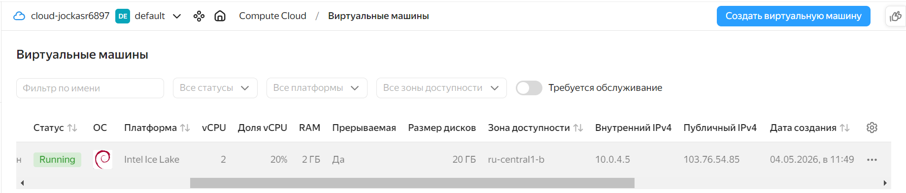

# Домашнее задание «Практическое применение Docker»
Из - за технических сложностей (образ Питона автоматически не подгружался, БД автоматически не создавалась и выдавала пустые запросы) пришлось переделывать проект (использовать вместо MySQL MariaDB и вручнукю скачивать образ Питон), а часть экспериментов была сделана на другой виртуальной машине, поэтому большая чать ответов в виде кода.

## Задание 0

Удаляем все пакеты docker-compose командой
```
root@docker-vm:/home/tankist# apt-get purge docker-compose-plugin -y
```
Псоле чего проверяем версию docker-compose и получаем ошибку:
```
root@docker-vm:/home/tankist# docker-compose --version
Command 'docker-compose' not found, but can be installed with:
snap install docker          # version 28.4.0, or
apt  install docker-compose  # version 1.29.2-1
See 'snap info docker' for additional versions.
```
Устанавливаем docker-compose командой
```
root@docker-vm:/home/tankist# apt-get install docker-compose -y
```
После чего проверяем наличие docker-compose:
```
root@docker-vm:/home/tankist# docker-compose --version
docker-compose version 1.29.2, build unknown
root@docker-vm:/home/tankist# docker-compose version
docker-compose version 1.29.2, build unknown
docker-py version: 5.0.3
CPython version: 3.10.12
OpenSSL version: OpenSSL 3.0.2 15 Mar 2022
```

## Задания 1 и 3

Репозиторий с проектом [тут](https://github.com/avdevninsr/shvirtd-example-python).</br>
Скачиваем докер образ Питона вручную, так как автоматически он не подгружается:
```
tankist@docker-debian:~/docker-project-2/shvirtd-example-python$ docker pull python:3.12-slim
3.12-slim: Pulling from library/python
3fc9d9ab5045: Pull complete
cb8c0a9140ac: Pull complete
4d873bcef452: Pull complete
3531af2bc2a9: Pull complete
75cf1a72ec4f: Download complete
67a6ed3b38af: Download complete
Digest: sha256:46cb7cc2877e60fbd5e21a9ae6115c30ace7a077b9f8772da879e4590c18c2e3
Status: Downloaded newer image for python:3.12-slim
docker.io/library/python:3.12-slim
```
Далее тестируем сборку проекта:
```
tankist@docker-debian:~/docker-project-2/shvirtd-example-python$ docker compose build
WARN[0000] /home/tankist/docker-project-2/shvirtd-example-python/proxy.yaml: the attribute `version` is obsolete, it will be ignored, please remove it to avoid potential confusion
WARN[0000] /home/tankist/docker-project-2/shvirtd-example-python/compose.yaml: the attribute `version` is obsolete, it will be ignored, please remove it to avoid potential confusion
[+] Building 57.5s (13/13) FINISHED
 => [internal] load local bake definitions                                                                       0.0s
 => => reading from stdin 564B                                                                                   0.0s
 => [internal] load build definition from Dockerfile.python                                                      0.0s
 => => transferring dockerfile: 354B                                                                             0.0s
 => [internal] load metadata for docker.io/library/python:3.12-slim                                              0.0s
 => [internal] load .dockerignore                                                                                0.0s
 => => transferring context: 126B                                                                                0.0s
 => [1/6] FROM docker.io/library/python:3.12-slim@sha256:46cb7cc2877e60fbd5e21a9ae6115c30ace7a077b9f8772da879e4  0.1s
 => => resolve docker.io/library/python:3.12-slim@sha256:46cb7cc2877e60fbd5e21a9ae6115c30ace7a077b9f8772da879e4  0.0s
 => [internal] load build context                                                                                0.0s
 => => transferring context: 56.46kB                                                                             0.0s
 => [2/6] RUN apt-get update && apt-get install -y     gcc     libpq-dev     && rm -rf /var/lib/apt/lists/*     21.8s
 => [3/6] WORKDIR /app                                                                                           0.1s
 => [4/6] COPY requirements.txt .                                                                                0.0s
 => [5/6] RUN pip install --no-cache-dir -r requirements.txt                                                    19.0s
 => [6/6] COPY . .                                                                                               0.1s
 => exporting to image                                                                                          16.2s
 => => exporting layers                                                                                         11.2s
 => => exporting manifest sha256:38494661cfecbcebe320f31ea0d8a08e05041c39a4b321ffa310344ea0fb2881                0.0s
 => => exporting config sha256:e74c5d7b4218af734cc48b6e334311d0e011010c198f00013254cad42b26b2c1                  0.0s
 => => exporting attestation manifest sha256:e426ab699c7c8af4684167c72b25fe8742f16f3a47952dcb642b71d2deec7911    0.0s
 => => exporting manifest list sha256:e430eb10e42fa67b18a1e35a1eb41a4def659d5f1bc32d7980d857e54b8b767e           0.0s
 => => naming to docker.io/library/web_app:latest                                                                0.0s
 => => unpacking to docker.io/library/web_app:latest                                                             4.9s
 => resolving provenance for metadata file                                                                       0.0s
[+] build 1/1
 ✔ Image web_app:latest Built                                                                                    57.6s
```
После успешной сборки проекта запускаем его:
```
tankist@docker-debian:~/docker-project-2/shvirtd-example-python$ docker compose up
WARN[0000] /home/tankist/docker-project-2/shvirtd-example-python/proxy.yaml: the attribute `version` is obsolete, it will be ignored, please remove it to avoid potential confusion
WARN[0000] /home/tankist/docker-project-2/shvirtd-example-python/compose.yaml: the attribute `version` is obsolete, it will be ignored, please remove it to avoid potential confusion
[+] up 33/33
 ✔ Image nginx:latest                        Pulled                                                              21.4s
 ✔ Image mariadb:10.6.4-focal                Pulled                                                              25.3s
 ✔ Image haproxy:2.4                         Pulled                                                              16.0s
 ✔ Network shvirtd-project_backend           Created                                                              0.1s
 ✔ Volume shvirtd-project_db_data            Created                                                              0.0s
 ✔ Container mysql-db-compose                Created                                                              1.8s
 ✔ Container shvirtd-project-reverse-proxy-1 Created                                                              1.8s
 ✔ Container shvirtd-project-ingress-proxy-1 Created                                                              1.8s
 ✔ Container web-app-compose                 Created                                                              0.1s
```
Подключаемся к базе данных:
```
tankist@docker-debian:~/docker-project-2/shvirtd-example-python$ docker exec -ti 0ff1cc3a49f5 mysql -uroot -pYtReWq4321
Welcome to the MariaDB monitor.  Commands end with ; or \g.
Your MariaDB connection id is 8
Server version: 10.6.4-MariaDB-1:10.6.4+maria~focal mariadb.org binary distribution
Copyright (c) 2000, 2018, Oracle, MariaDB Corporation Ab and others.
Type 'help;' or '\h' for help. Type '\c' to clear the current input statement.

MariaDB [(none)]> use virtd;
Reading table information for completion of table and column names
You can turn off this feature to get a quicker startup with -A
```
Отправляем запросы на наличие таблиц и на выдачу IP адресов "посетителей" сайта:
```
MariaDB [virtd]> show tables;
+-----------------+
| Tables_in_virtd |
+-----------------+
| api_logs_v2     |
+-----------------+
1 row in set (0.000 sec)

MariaDB [virtd]> SELECT * from api_logs_v2 LIMIT 10;
+----+---------------------+---------------+
| id | request_date        | request_ip    |
+----+---------------------+---------------+
|  1 | 2026-05-01 07:42:47 | 192.168.0.101 |
|  2 | 2026-05-01 07:42:48 | 192.168.0.101 |
|  3 | 2026-05-01 07:42:50 | 192.168.0.101 |
|  4 | 2026-05-01 07:42:51 | 192.168.0.101 |
+----+---------------------+---------------+
4 rows in set (0.001 sec)
```
После всех необходимых действий гасим проект одной командой:
```
tankist@docker-debian:~/docker-project-2/shvirtd-example-python$ docker compose down
WARN[0000] /home/tankist/docker-project-2/shvirtd-example-python/proxy.yaml: the attribute `version` is obsolete, it will be ignored, please remove it to avoid potential confusion
WARN[0000] /home/tankist/docker-project-2/shvirtd-example-python/compose.yaml: the attribute `version` is obsolete, it will be ignored, please remove it to avoid potential confusion
[+] down 5/5
 ✔ Container web-app-compose                 Removed                                                              0.5s
 ✔ Container shvirtd-project-reverse-proxy-1 Removed                                                              0.4s
 ✔ Container shvirtd-project-ingress-proxy-1 Removed                                                              0.2s
 ✔ Container mysql-db-compose                Removed                                                              0.5s
 ✔ Network shvirtd-project_backend           Removed                                                              0.2s
tankist@docker-debian:~/docker-project-2/shvirtd-example-python$ docker ps -a
CONTAINER ID   IMAGE     COMMAND   CREATED   STATUS    PORTS     NAMES
```

## Задание 4

Создаём ВМ в Yandex Cloud. Наличие ВМ продемонстрировано на рисунке 1.

</br>
Рисунок 1. ВМ в облаке.</br>
Далее устанавливаем на эту ВМ Докер и с помощью скрипта [deploy.sh](https://github.com/avdevninsr/shvirtd-example-python/blob/main/deploy.sh) разворачиваем и запускаем проект.</br>
Демонстрация того, что проект запущен представлена на рисунке 2.</br>

</br>
Рисунок 2. Проект запущен.</br>
Далее отправляем запрос к БД, что продемонстрировано на рисунке 3.</br>

</br>
Рисунок 3. Содержимое базы данных.</br>

## Задание 6

Команда docker dive не доступна по умолчанию, поэтому её необходимо установить:
```
root@docker-debian:~# DIVE_VERSION=$(curl -sL "https://api.github.com/repos/wagoodman/dive/releases/latest" | grep '"tag_name":' | sed -E 's/.*"v([^"]+)".*/\1/')
curl -OL https://github.com/wagoodman/dive/releases/download/v${DIVE_VERSION}/dive_${DIVE_VERSION}_linux_amd64.deb
sudo apt install ./dive_${DIVE_VERSION}_linux_amd64.deb
  % Total    % Received % Xferd  Average Speed   Time    Time     Time  Current
                                 Dload  Upload   Total   Spent    Left  Speed
  0     0    0     0    0     0      0      0 --:--:-- --:--:-- --:--:--     0
100 3938k  100 3938k    0     0  2907k      0  0:00:01  0:00:01 --:--:-- 9278k
Чтение списков пакетов… Готово
Построение дерева зависимостей… Готово
Чтение информации о состоянии… Готово
Заметьте, вместо «./dive_0.13.1_linux_amd64.deb» выбирается «dive»
Следующие НОВЫЕ пакеты будут установлены:
  dive
Обновлено 0 пакетов, установлено 1 новых пакетов, для удаления отмечено 0 пакетов, и 3 пакетов не обновлено.
Необходимо скачать 0 B/4 033 kB архивов.
После данной операции объём занятого дискового пространства возрастёт на 9 863 kB.
Пол:1 /root/dive_0.13.1_linux_amd64.deb dive amd64 0.13.1 [4 033 kB]
Выбор ранее не выбранного пакета dive.
(Чтение базы данных … на данный момент установлено 196696 файлов и каталогов.)
Подготовка к распаковке …/dive_0.13.1_linux_amd64.deb …
Распаковывается dive (0.13.1) …
Настраивается пакет dive (0.13.1) …
N: Загрузка выполняется от лица суперпользователя без ограничений песочницы, так как файл «/root/dive_0.13.1_linux_amd64.deb» недоступен для пользователя «_apt». - pkgAcquire::Run (13: Отказано в доступе)
root@docker-debian:~# dive --version
dive 0.13.1
tankist@docker-debian:~$ dive hashicorp/terraform:latest
Image Source: docker://hashicorp/terraform:latest
Extracting image from docker-engine... (this can take a while for large images)
Analyzing image...
Building cache...
```
После установке сканируем скачанный образ Терраформа, что продемонстрировано на рисунке 4:

</br>
Рисунок 4. Содержимое образа Терраформ.</br>
Как сказано на официальном сайте Докера: "Команда docker save не предназначена для сохранения конкретных файлов образа, она сохраняет образ исключительно целиком". Но я всё же нашёл способ это сделать.</br>
```
tankist@docker-debian:~$ docker save -o terraform-latest.tar hashicorp/terraform:latest
```
Сначала на всякий случай даём архиву максимальные права (потом всё равно удалим) и утилитой tar распаковываем его:
```
root@docker-vm:/home/tankist/Опыты с Терраформом# chmod 777 terraform-latest.tar
root@docker-vm:/home/tankist/Опыты с Терраформом# tar -xvf terraform-latest.tar
blobs/
blobs/sha256/
blobs/sha256/278ee20f2c63c723e9c27a3e07ac9607fc3a88bcf05db770b3b6998b74d87171
blobs/sha256/76cbedd71a05bf6e8513645fbf8bf436d911348bb3f027280fb28a7476ed12d0
blobs/sha256/850ab86db08b9009333767db0762326b9e77cf592be91d8e23ecdeba5882367c
blobs/sha256/9655b37d50eca9b7f7b6555c7f84387777120aad34a2d5dad8128fc6e4d872f9
blobs/sha256/b63b6a8c18752d651a890883bad83b8cfe1189f3bf74273b18f9326386f015b2
blobs/sha256/c89ed543266c8756e04791fd68eaa45063c91f802a793c0df6cb522ee435ba2d
blobs/sha256/f91d70913d919004e5334957efa67defa932b2273ccd34340e7003a2a4bd2d4a
index.json
manifest.json
oci-layout
root@docker-vm:/home/tankist/Опыты с Терраформом# rm -r terraform-latest.tar
```
Далее необходимо установить российский 7zip, просто unzip не подойдёт!
```
root@docker-vm:/home/tankist/Опыты с Терраформом# apt-get install p7zip-full -y
root@docker-vm:/home/tankist/Опыты с Терраформом# dpkg --list | grep zip
ii  gzip                                   1.10-4ubuntu4.1                                  amd64        GNU compression utilities
ii  p7zip                                  16.02+dfsg-8                                     amd64        7zr file archiver with high compression ratio
ii  p7zip-full                             16.02+dfsg-8                                     amd64        7z and 7za file archivers with high compression ratio
ii  python3-zipp                           1.0.0-3ubuntu0.1                                 all          pathlib-compatible Zipfile object wrapper - Python 3.x
```
Далее в blobs/sha256 находим самый большой по размеру файл (папка bin занимала больше всего памяти если судить по выводу команды docker dive) и ДВАЖДЫ распаковываем его через 7zip:
```
root@docker-vm:/home/tankist/Опыты с Терраформом# 7z x 850ab86db08b9009333767db0762326b9e77cf592be91d8e23ecdeba5882367c
7-Zip [64] 16.02 : Copyright (c) 1999-2016 Igor Pavlov : 2016-05-21
p7zip Version 16.02 (locale=ru_RU.UTF-8,Utf16=on,HugeFiles=on,64 bits,2 CPUs Intel(R) Core(TM) i5-5200U CPU @ 2.20GHz (306D4),ASM,AES-NI)
Scanning the drive for archives:
1 file, 36446777 bytes (35 MiB)
Extracting archive: 850ab86db08b9009333767db0762326b9e77cf592be91d8e23ecdeba5882367c
--
Path = 850ab86db08b9009333767db0762326b9e77cf592be91d8e23ecdeba5882367c
Type = gzip
Headers Size = 10
Everything is Ok
Size:       116926976
Compressed: 36446777

root@docker-vm:/home/tankist/Опыты с Терраформом# 7z x 850ab86db08b9009333767db0762326b9e77cf592be91d8e23ecdeba5882367c~
7-Zip [64] 16.02 : Copyright (c) 1999-2016 Igor Pavlov : 2016-05-21
p7zip Version 16.02 (locale=ru_RU.UTF-8,Utf16=on,HugeFiles=on,64 bits,2 CPUs Intel(R) Core(TM) i5-5200U CPU @ 2.20GHz (306D4),ASM,AES-NI)
Scanning the drive for archives:
1 file, 116926976 bytes (112 MiB)
Extracting archive: 850ab86db08b9009333767db0762326b9e77cf592be91d8e23ecdeba5882367c~
--
Path = 850ab86db08b9009333767db0762326b9e77cf592be91d8e23ecdeba5882367c~
Type = tar
Physical Size = 116926976
Headers Size = 2048
Code Page = UTF-8
Everything is Ok
Folders: 1
Files: 1
Size:       116924600
Compressed: 116926976
```
Далее удаляем папку blobs и остальные образовавшиеся при распаковки файлы, они нам больше не понадобятся.</br>
Далее переходим в папку bin, присваиваем файлу terraform максимальные права (иначе может не сработать), после чего проверяем версию:
```
root@docker-vm:/home/tankist/Опыты с Терраформом# cd bin && ls -la
total 114196
drwx------ 2 root    root         4096 мая  1 15:55 .
drwxrwxr-x 3 tankist tankist      4096 мая  4 10:50 ..
-rw-r--r-- 1 root    root    116924600 мая  1 15:50 terraform
root@docker-vm:/home/tankist/Опыты с Терраформом/bin# chmod 777 terraform
root@docker-vm:/home/tankist/Опыты с Терраформом/bin# ./terraform --version
Terraform v1.15.1
on linux_amd64
```
Задача выполнена!</br>
С помощью команды docker cp вытащить из образа нужные файлы можно двумя способами.</br>
Способ 1:
```
tankist@docker-debian:~$ docker create --name temp-terraform hashicorp/terraform:latest
52ee8f6e47db4e30923c8a69ef66c64b6e34655ec29478e3bf29077d7b2861f8
tankist@docker-debian:~$ docker cp  temp-terraform:/bin/terraform ./terraform
Successfully copied 117MB (transferred 117MB) to /home/tankist/terraform
tankist@docker-debian:~$ ls -la ./terraform
-rwxr-xr-x 1 tankist tankist 116932792 апр 29 17:18 ./terraform
tankist@docker-debian:~$ ./terraform --version
Terraform v1.15.0
on linux_amd64
```
Способ 2:
```
tankist@docker-debian:~$ docker run --rm --entrypoint /bin/sh hashicorp/terraform:latest -c "which terraform"
/bin/terraform
tankist@docker-debian:~$ docker create --name temp-terraform2 hashicorp/terraform:latest
cb002e8f1640d8bbf33d161c15caf4d24f14e0bed62d26a076006c91d2f2e781
tankist@docker-debian:~$ docker cp  temp-terraform2:/bin/terraform ./terraform
Successfully copied 117MB (transferred 117MB) to /home/tankist/terraform
tankist@docker-debian:~$ ./terraform version
Terraform v1.15.0
on linux_amd64
```
Задача выполнена!</br>
Вывод по заданию 6 и 6.1: с помощью команды docker cp гораздо проще и быстрее вытащить из образа нужные файлы.